# Skin Cancer Detection

### Problem Statement:
The goal of this project is to accurately detect skin cancer by analyzing images of skin lesions. By leveraging advanced image processing and machine learning techniques, particularly deep learning, this application aims to classify skin lesions and provide early diagnostic insights that can assist healthcare professionals in making informed decisions.

### Approach:
1. **Data Collection**: This project utilizes a dataset of labeled skin lesion images, including various types of skin cancers such as melanoma and benign lesions.
   
2. **Data Preprocessing**: Images undergo preprocessing steps, including resizing, normalization, and augmentation, to improve model robustness and accuracy.
   
3. **Modeling**: A convolutional neural network (CNN) or other deep learning architecture is trained on the preprocessed images. Techniques like transfer learning may be used to leverage pre-trained models for enhanced performance.

4. **Evaluation**: Model performance is evaluated based on metrics such as accuracy, precision, recall, and F1-score. Cross-validation may also be employed to ensure generalizability.

5. **Deployment**: The model can be deployed as a web application, allowing users to upload images and receive diagnostic predictions.

### Requirements:
- Python 3.x
- TensorFlow or PyTorch
- OpenCV
- NumPy, Pandas, Matplotlib
- Scikit-Learn

### Installation:
1. Clone this repository:
   ```bash
   git clone https://github.com/your-username/skin-cancer-detection.git
   ```
2. Navigate to the project directory:
   ```bash
   cd skin-cancer-detection
   ```
3. Install the required dependencies:
   ```bash
   pip install -r requirements.txt
   ```

### Usage:
1. Run the preprocessing script to prepare the dataset.
2. Train the model using the training script provided.
3. Evaluate the model performance and fine-tune if necessary.
4. Use the prediction script or web app to make predictions on new images.


### Future Improvements:
- Include additional types of skin lesions to broaden the model's classification capabilities.
- Integrate with cloud platforms to improve accessibility and scalability.
- Add interpretability tools to better understand model predictions.


### Screenshots

Below are screenshots demonstrating the project:

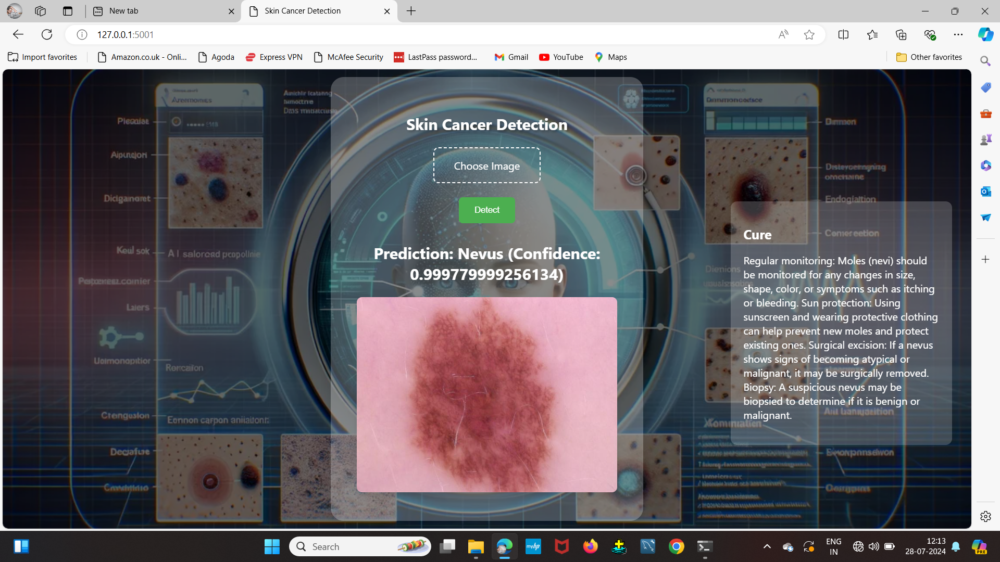
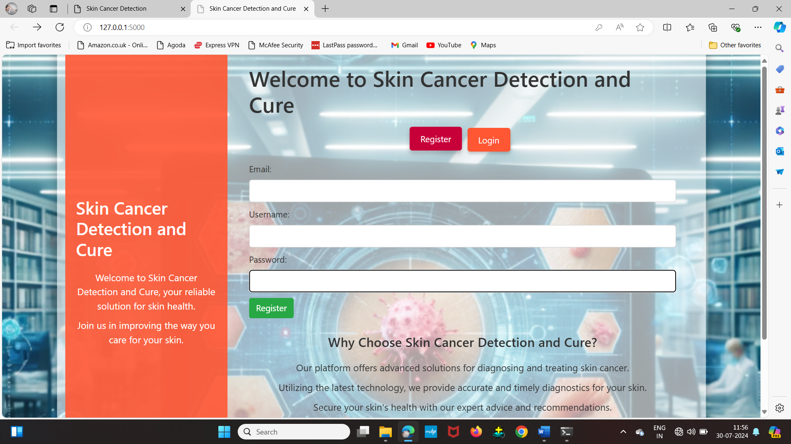
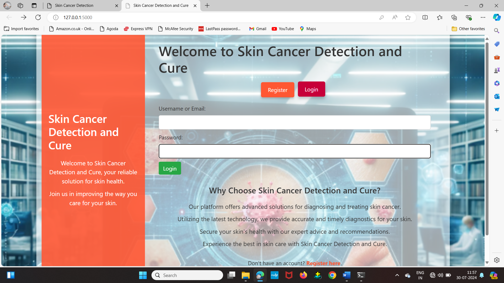
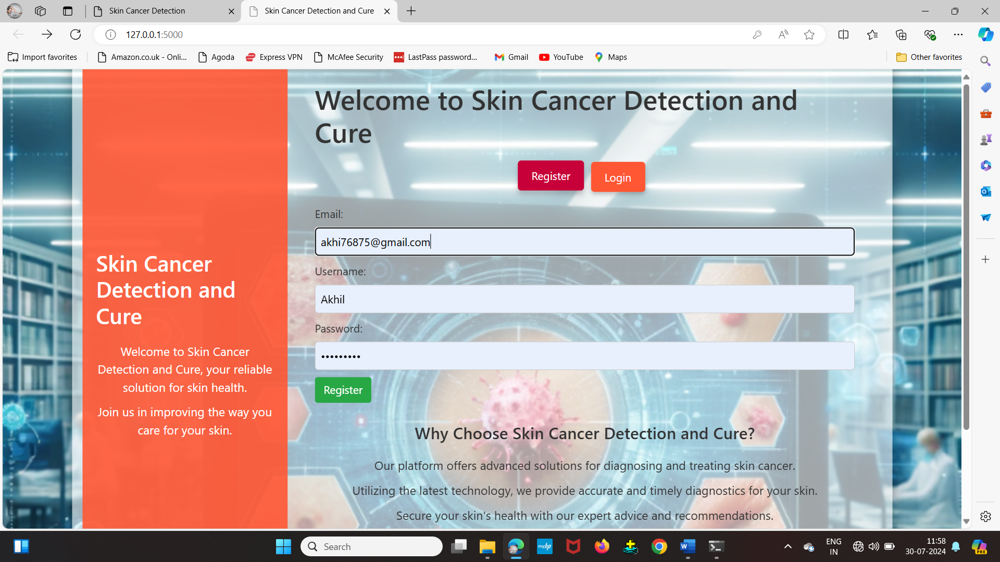
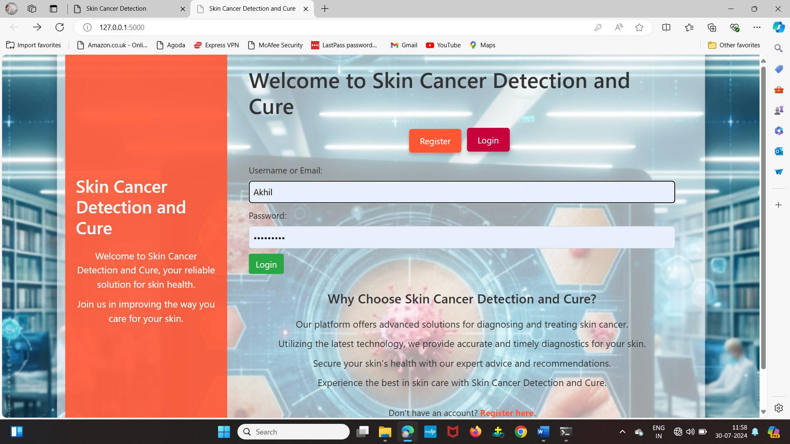
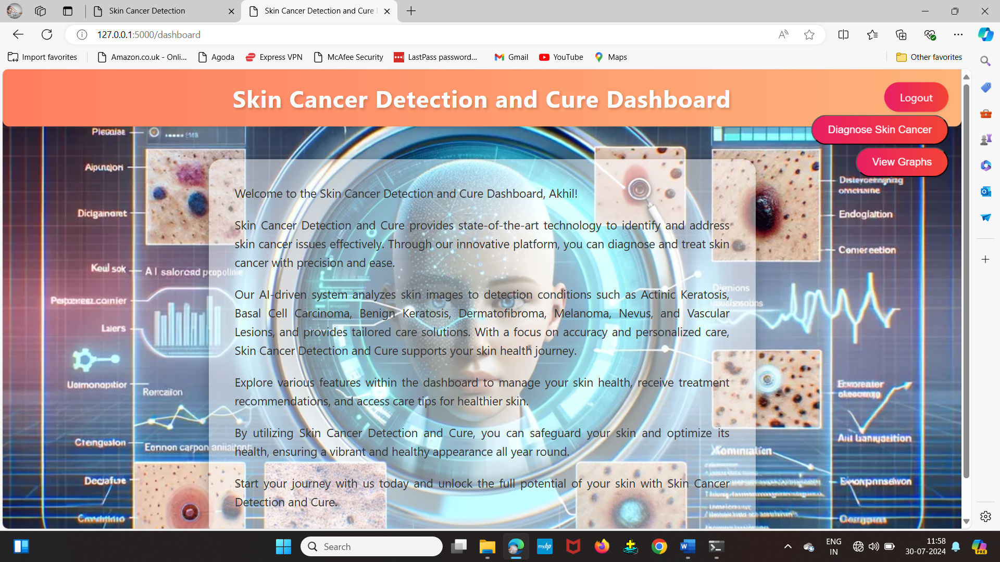
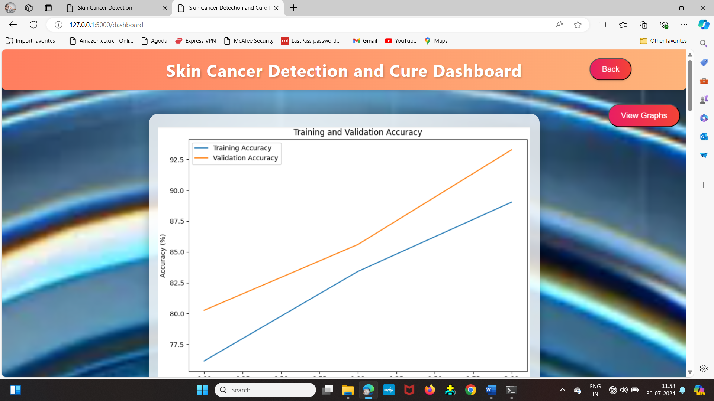
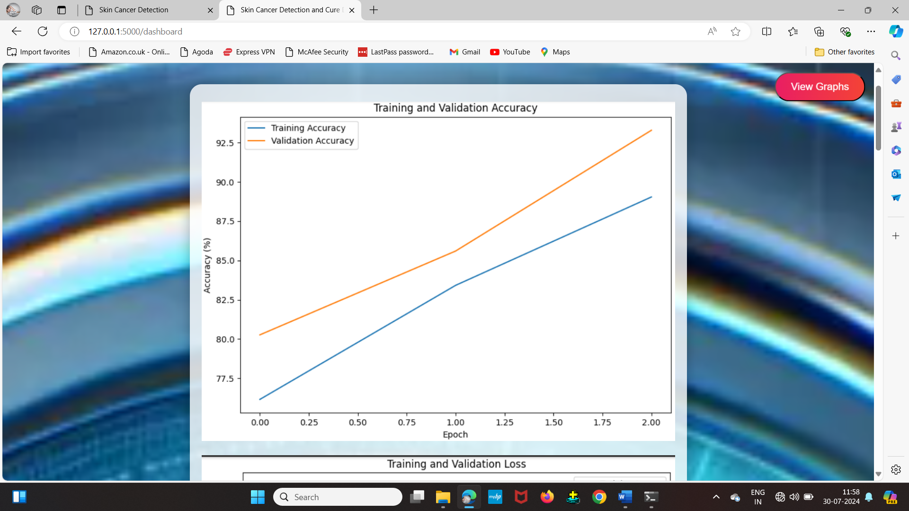
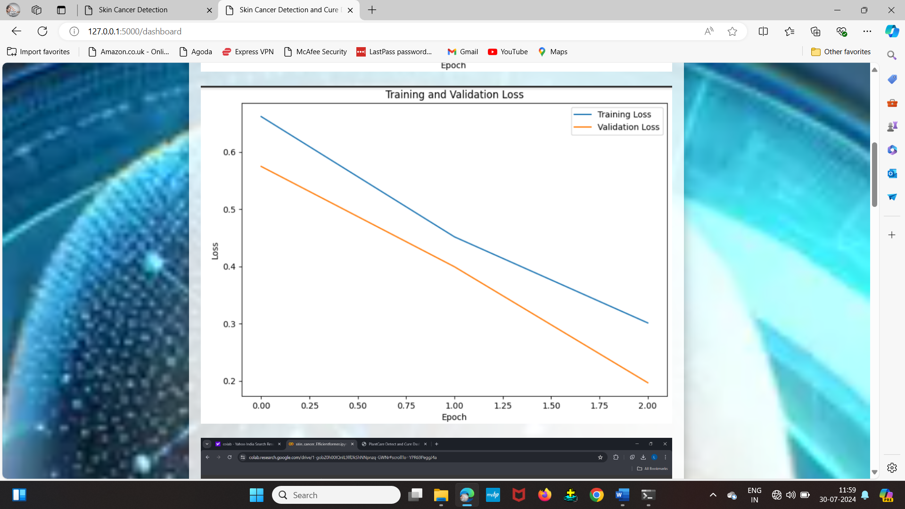
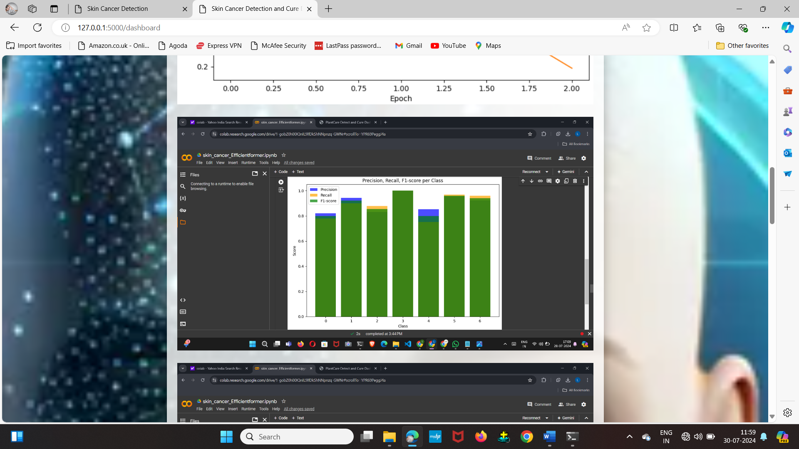
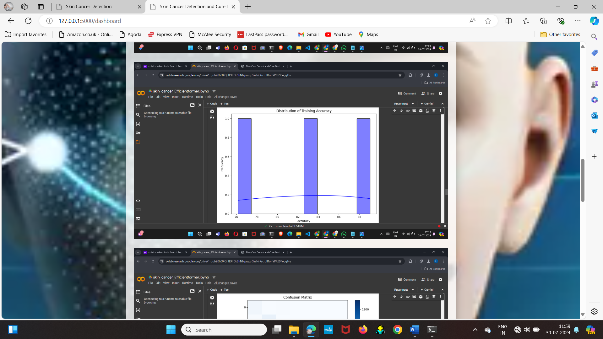